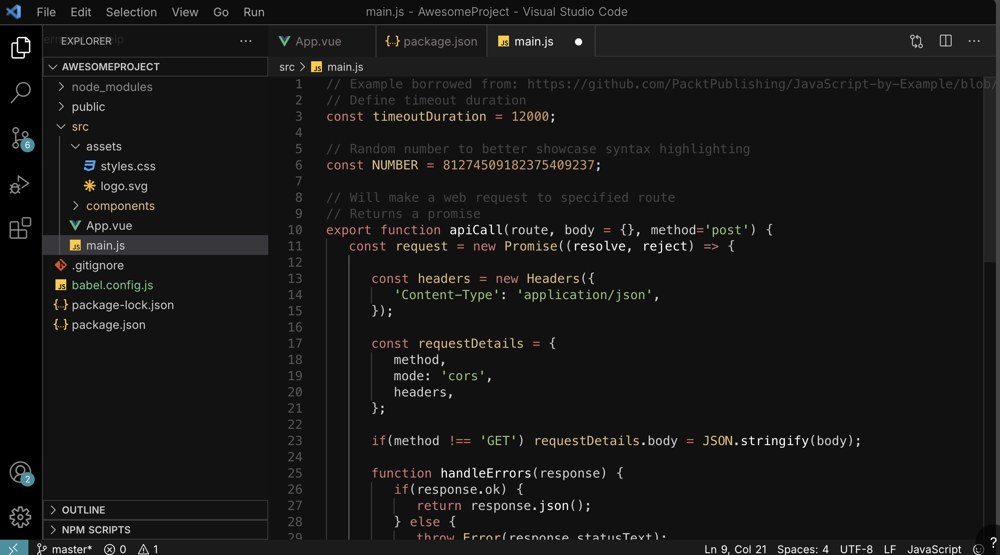

# Gagarin Theme - Theme For Visual Studio Code  

A retro-futuristic theme inspired by space exploration and the legendary Yuri Gagarin, the first human in space.  
Designed to bring a cosmic and vintage atmosphere to your coding experience 🚀✨.  

---

---

## Installation  

1. Open [Visual Studio Marketplace](https://marketplace.visualstudio.com/).  
2. Search for **"Gagarin Theme"** or [click here](https://example.com/gagarin-theme) to go directly to the extension page.  
3. Click **Install** and enjoy coding among the stars 🌌.  

---

## Team  

Just me – passionate about coding, design, and space history. 👨‍🚀  

---

## Changelog  

### v0.0.5  
- Initial release of **Gagarin Theme**.  
- Added full color scheme inspired by retro space aesthetics.  
- First public release on VS Code Marketplace.  

## v0.0.7

- Initial configs

---

